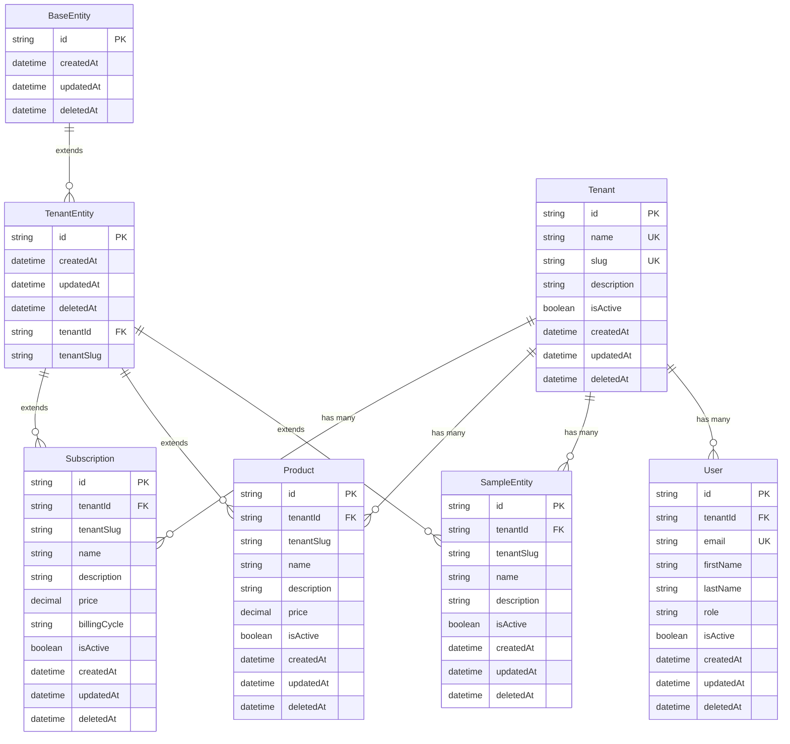

# Entity Relationship Diagram (ERD)

This document contains the Entity Relationship Diagram for the database schema.

## 🏗️ Complete ERD



## 📊 Entity Hierarchy

### **Abstract Base Classes**
- **`BaseEntity`**: Common fields for all entities
- **`TenantEntity`**: Multi-tenant base class

### **Concrete Entities**
- **`Tenant`**: Root tenant entity
- **`User`**: System users
- **`SampleEntity`**: Example framework entity
- **`Product`**: Generic product entity
- **`Subscription`**: Generic subscription entity

## 🔗 Relationship Types

### **One-to-Many Relationships**
- **Tenant → User**: One tenant has many users
- **Tenant → SampleEntity**: One tenant has many sample entities
- **Tenant → Product**: One tenant has many products
- **Tenant → Subscription**: One tenant has many subscriptions

### **Inheritance Relationships**
- **BaseEntity → TenantEntity**: TenantEntity extends BaseEntity
- **TenantEntity → SampleEntity**: SampleEntity extends TenantEntity
- **TenantEntity → Product**: Product extends TenantEntity
- **TenantEntity → Subscription**: Subscription extends TenantEntity

## 📋 Field Legend

### **Primary Keys**
- **`id`**: UUID v4 primary key
- **`PK`**: Primary Key

### **Foreign Keys**
- **`tenantId`**: References `tenants.id`
- **`FK`**: Foreign Key

### **Unique Keys**
- **`name`**: Unique name within tenant
- **`slug`**: Unique slug across all tenants
- **`email`**: Unique email across all tenants
- **`UK`**: Unique Key

### **Common Fields**
- **`createdAt`**: Record creation timestamp
- **`updatedAt`**: Record last update timestamp
- **`deletedAt`**: Soft delete timestamp
- **`isActive`**: Entity status flag

## 🎯 Multi-Tenancy Design

### **Tenant Isolation**
- All entities (except Tenant) belong to a tenant
- Data is completely isolated between tenants
- Queries must include tenant context

### **Tenant Context**
- **`tenantId`**: Internal tenant reference
- **`tenantSlug`**: Human-readable tenant identifier
- **Tenant Service**: Manages current tenant context

## 🔧 Database Conventions

### **Naming Conventions**
- **Tables**: `snake_case` (e.g., `sample_entities`)
- **Columns**: `snake_case` (e.g., `created_at`)
- **Indexes**: `idx_{table}_{column}` (e.g., `idx_users_tenant_id`)
- **Foreign Keys**: `{table}_{column}_fk` (e.g., `users_tenant_id_fk`)

### **Data Types**
- **Primary Keys**: `string` (UUID v4)
- **Timestamps**: `datetime` (ISO 8601)
- **Booleans**: `boolean` (true/false)
- **Decimals**: `decimal` (for prices)
- **Strings**: `string` (varchar/text)

## 🚀 Query Patterns

### **Tenant-Scoped Queries**
```typescript
// Find all entities for a tenant
const entities = await repository.find({
  where: { tenantId: 'tenant-uuid' }
});

// Find by tenant slug
const entities = await repository.find({
  where: { tenantSlug: 'tenant-slug' }
});
```

### **Relationship Queries**
```typescript
// Find tenant with all related data
const tenant = await tenantRepository.findOne({
  where: { id: 'tenant-uuid' },
  relations: ['users', 'sampleEntities', 'products', 'subscriptions']
});
```

## 🔒 Security Considerations

### **Data Isolation**
- Row-level security by tenant
- No cross-tenant data access
- Tenant context validation

### **Access Control**
- User authentication required
- Tenant authorization checks
- Role-based permissions

### **Data Integrity**
- Foreign key constraints
- Unique constraint validation
- Check constraint enforcement

---

**Last Updated**: {{ current_date }}
**Schema Version**: 1.0.0
**Diagram Version**: 1.0.0
