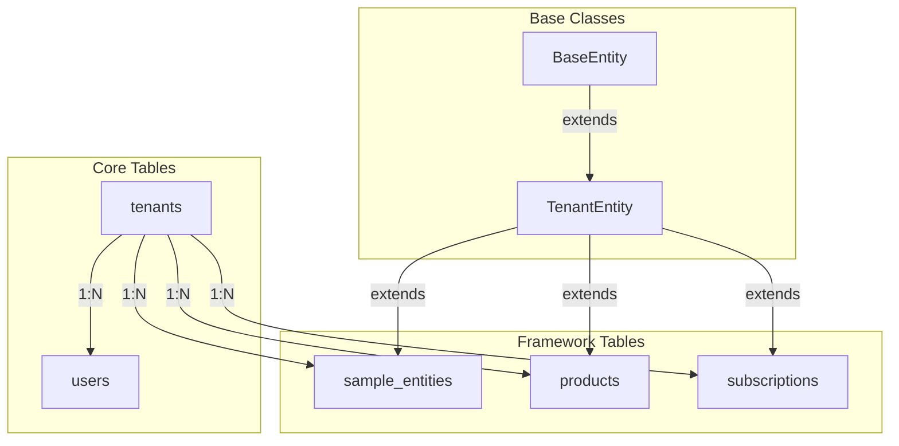
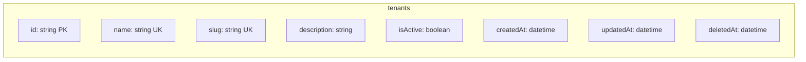
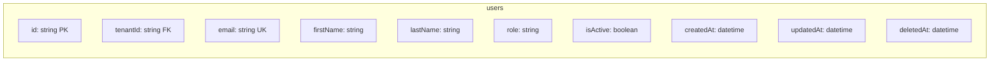
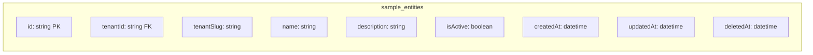
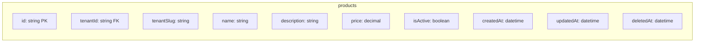
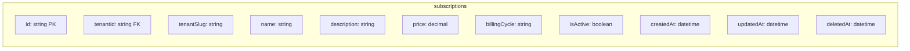
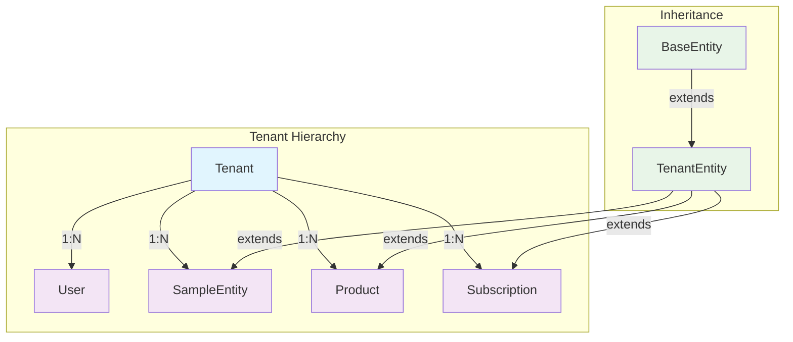
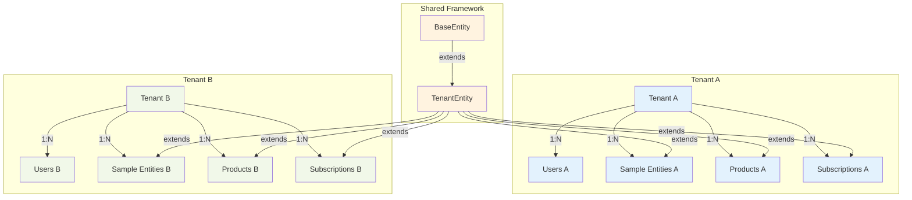

# Database Schema Diagram

This document contains the database schema diagram showing table structures and relationships.

## 🏗️ Schema Overview



## 📊 Table Structures

### **tenants**


### **users**


### **sample_entities**


### **products**


### **subscriptions**


## 🔗 Relationship Map



## 📋 Index Structure

### **Primary Indexes**
- **tenants**: `id` (PK)
- **users**: `id` (PK)
- **sample_entities**: `id` (PK)
- **products**: `id` (PK)
- **subscriptions**: `id` (PK)

### **Unique Indexes**
- **tenants**: `name`, `slug`
- **users**: `email`

### **Foreign Key Indexes**
- **users**: `tenant_id`
- **sample_entities**: `tenant_id`
- **products**: `tenant_id`
- **subscriptions**: `tenant_id`

### **Performance Indexes**
- **All tables**: `is_active`
- **All tables**: `deleted_at`
- **Tenant entities**: `tenant_slug`

## 🎯 Multi-Tenancy Architecture



## 🔧 Database Conventions

### **Table Naming**
- **Snake Case**: `sample_entities`, `user_roles`
- **Plural Forms**: `users`, `products`, `subscriptions`
- **Descriptive Names**: Clear, meaningful table names

### **Column Naming**
- **Snake Case**: `created_at`, `tenant_id`
- **Descriptive Names**: `firstName`, `billingCycle`
- **Consistent Patterns**: `isActive`, `tenantSlug`

### **Constraint Naming**
- **Primary Keys**: `{table}_pkey`
- **Foreign Keys**: `{table}_{column}_fk`
- **Unique Keys**: `{table}_{column}_key`
- **Check Constraints**: `{table}_{column}_check`

## 🚀 Query Patterns

### **Tenant-Scoped Queries**
```sql
-- Find all entities for a tenant
SELECT * FROM sample_entities 
WHERE tenant_id = 'tenant-uuid' 
AND deleted_at IS NULL;

-- Find by tenant slug
SELECT * FROM sample_entities 
WHERE tenant_slug = 'tenant-slug' 
AND deleted_at IS NULL;
```

### **Relationship Queries**
```sql
-- Find tenant with all related data
SELECT t.*, u.*, se.*, p.*, s.*
FROM tenants t
LEFT JOIN users u ON t.id = u.tenant_id
LEFT JOIN sample_entities se ON t.id = se.tenant_id
LEFT JOIN products p ON t.id = p.tenant_id
LEFT JOIN subscriptions s ON t.id = s.tenant_id
WHERE t.id = 'tenant-uuid';
```

---

**Last Updated**: {{ current_date }}
**Schema Version**: 1.0.0
**Diagram Version**: 1.0.0
