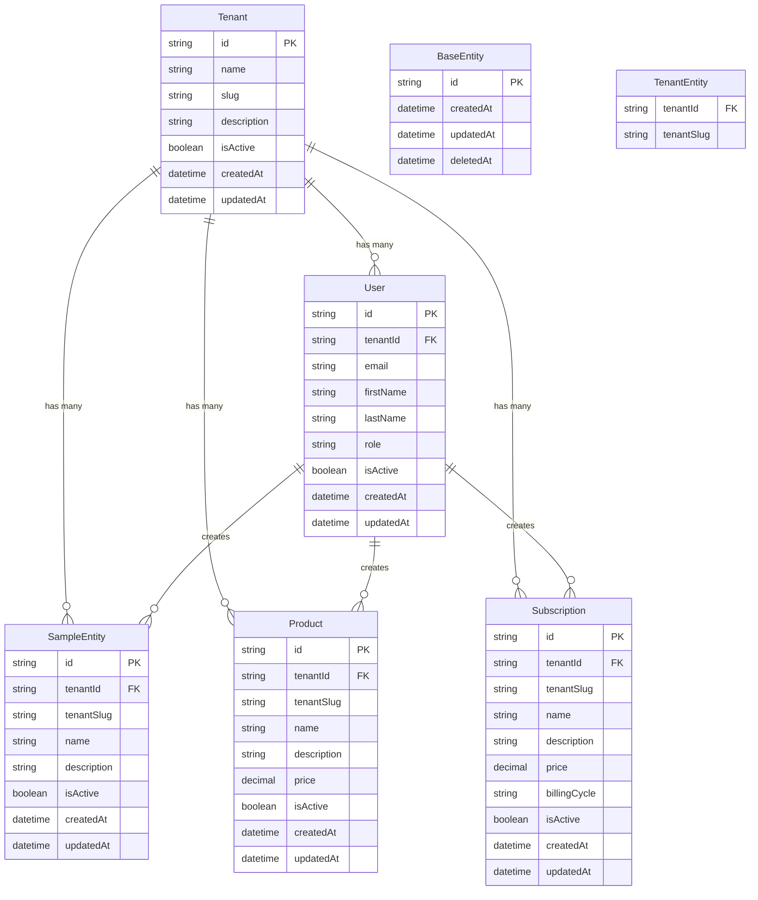

# Entity Relationships

This document describes the relationships between all entities in the database.

## 🔗 Relationship Overview



## 📊 Relationship Details

### **1. Tenant → User (One-to-Many)**
- **Type**: `OneToMany`
- **Foreign Key**: `users.tenant_id` → `tenants.id`
- **Description**: A tenant can have multiple users
- **Cascade**: None (users are managed separately)
- **Index**: `idx_users_tenant_id`

### **2. Tenant → SampleEntity (One-to-Many)**
- **Type**: `OneToMany`
- **Foreign Key**: `sample_entities.tenant_id` → `tenants.id`
- **Description**: A tenant can have multiple sample entities
- **Cascade**: None (entities are managed separately)
- **Index**: `idx_sample_entities_tenant_id`

### **3. Tenant → Product (One-to-Many)**
- **Type**: `OneToMany`
- **Foreign Key**: `products.tenant_id` → `tenants.id`
- **Description**: A tenant can have multiple products
- **Cascade**: None (products are managed separately)
- **Index**: `idx_products_tenant_id`

### **4. Tenant → Subscription (One-to-Many)**
- **Type**: `OneToMany`
- **Foreign Key**: `subscriptions.tenant_id` → `tenants.id`
- **Description**: A tenant can have multiple subscriptions
- **Cascade**: None (subscriptions are managed separately)
- **Index**: `idx_subscriptions_tenant_id`

## 🔧 TypeORM Relationship Configuration

### **Tenant Entity**
```typescript
@Entity('tenants')
export class Tenant extends BaseEntity {
  // ... other fields

  @OneToMany(() => User, user => user.tenant)
  users: User[];

  @OneToMany(() => SampleEntity, entity => entity.tenant)
  sampleEntities: SampleEntity[];

  @OneToMany(() => Product, product => product.tenant)
  products: Product[];

  @OneToMany(() => Subscription, subscription => subscription.tenant)
  subscriptions: Subscription[];
}
```

### **User Entity**
```typescript
@Entity('users')
export class User extends BaseEntity {
  // ... other fields

  @ManyToOne(() => Tenant, tenant => tenant.users)
  @JoinColumn({ name: 'tenantId' })
  tenant: Tenant;
}
```

### **SampleEntity**
```typescript
@Entity('sample_entities')
export class SampleEntity extends TenantEntity {
  // ... other fields

  @ManyToOne(() => Tenant)
  @JoinColumn({ name: 'tenantId' })
  tenant: Tenant;
}
```

## 🚀 Query Examples

### **Find Tenant with All Related Data**
```typescript
const tenant = await tenantRepository.findOne({
  where: { id: 'tenant-uuid' },
  relations: ['users', 'sampleEntities', 'products', 'subscriptions']
});
```

### **Find User with Tenant**
```typescript
const user = await userRepository.findOne({
  where: { id: 'user-uuid' },
  relations: ['tenant']
});
```

### **Find Sample Entities by Tenant**
```typescript
const entities = await sampleEntityRepository.find({
  where: { tenantId: 'tenant-uuid' },
  relations: ['tenant']
});
```

## 🔒 Security Considerations

### **Tenant Isolation**
- All queries must include tenant context
- Cross-tenant access is prevented by design
- Foreign key constraints ensure data integrity

### **Cascade Operations**
- No cascade deletes to prevent accidental data loss
- Soft deletes are used instead of hard deletes
- Manual cleanup required for related data

### **Data Integrity**
- Foreign key constraints prevent orphaned records
- Unique constraints prevent duplicate data
- Check constraints validate data ranges

## 📋 Relationship Rules

### **Creation Rules**
1. Tenant must exist before creating users/entities
2. All entities must have valid tenant reference
3. User must belong to a tenant

### **Deletion Rules**
1. Soft delete entities before hard deleting tenant
2. Check for related data before tenant deletion
3. Maintain referential integrity

### **Update Rules**
1. Tenant ID cannot be changed after creation
2. User tenant association cannot be changed
3. Entity tenant association cannot be changed

---

**Last Updated**: {{ current_date }}
**Schema Version**: 1.0.0
