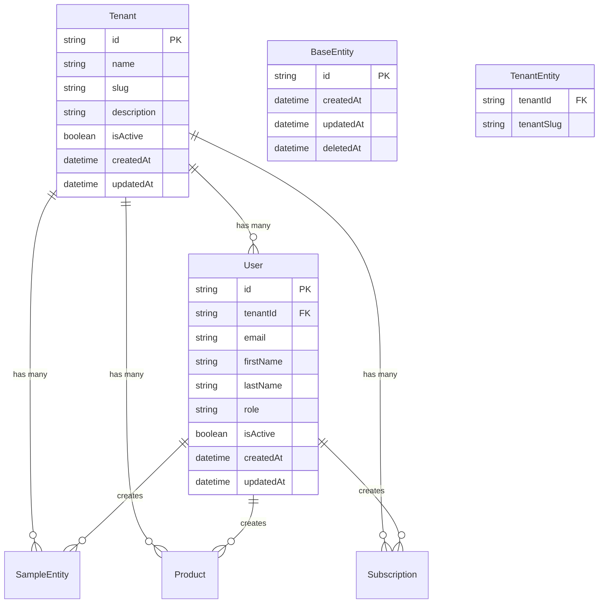

# Database Schema Overview

This document provides a high-level overview of the database schema for the Generic Framework.

## 🏗️ Architecture

The database follows a **multi-tenant architecture** with the following key principles:

- **Tenant Isolation**: All data is isolated by `tenantId`
- **Generic Design**: Framework-agnostic entities that can be extended
- **Clean Architecture**: Separation of concerns with clear entity boundaries
- **Audit Trail**: All entities include creation and modification tracking

## 📊 Core Entities

### **Base Entities**
- **`BaseEntity`** - Abstract base class with common fields
- **`TenantEntity`** - Multi-tenant base class extending BaseEntity
- **`User`** - System users (admin, staff, etc.)
- **`Tenant`** - Tenant/organization information

### **Framework Entities**
- **`SampleEntity`** - Example entity demonstrating framework patterns
- **`Product`** - Generic product/service entity
- **`Subscription`** - Generic subscription/plan entity

## 🔗 Key Relationships

## 🎯 Multi-Tenancy Strategy

### **Tenant Isolation**
- **Row-Level Security**: All queries filtered by `tenantId`
- **Tenant Context**: Every entity belongs to a specific tenant
- **Data Segregation**: Complete isolation between tenants

### **Tenant Identification**
- **`tenantId`**: UUID for internal references
- **`tenantSlug`**: Human-readable identifier for URLs
- **Tenant Context Service**: Manages current tenant context

## 📋 Database Conventions

### **Naming Conventions**
- **Tables**: `snake_case` (e.g., `sample_entities`)
- **Columns**: `snake_case` (e.g., `created_at`, `tenant_id`)
- **Indexes**: `idx_{table}_{column}` (e.g., `idx_users_tenant_id`)
- **Foreign Keys**: `{table}_{column}_fk` (e.g., `users_tenant_id_fk`)

### **Field Standards**
- **Primary Keys**: UUID v4 (`string`)
- **Timestamps**: ISO 8601 format (`datetime`)
- **Soft Deletes**: `deleted_at` field (nullable)
- **Audit Fields**: `created_at`, `updated_at` (required)

### **Constraints**
- **NOT NULL**: All required fields
- **UNIQUE**: Email addresses, tenant slugs
- **FOREIGN KEY**: All relationships properly constrained
- **CHECK**: Data validation constraints

## 🔧 Database Tools

### **TypeORM Configuration**
- **Entity Files**: `apps/backend/src/domain/entities/`
- **Migration Files**: `apps/backend/src/migrations/`
- **Repository Pattern**: Generic repositories for all entities

### **Development Tools**
- **Database**: PostgreSQL 15+
- **Admin Interface**: pgAdmin 4
- **Migrations**: TypeORM CLI
- **Seeding**: Custom seed scripts

## 📚 Documentation Structure

- **[Entity Documentation](entities/)** - Detailed entity specifications
- **[Relationships](relationships/)** - Table relationships and constraints
- **[Migrations](migrations/)** - Migration history and notes
- **[Diagrams](diagrams/)** - Visual database representations

## 🚀 Getting Started

1. **Review Entity Structure**: Check individual entity documentation
2. **Understand Relationships**: Study the relationship diagrams
3. **Run Migrations**: Set up the database schema
4. **Explore Data**: Use pgAdmin to explore the database

## 🔄 Maintenance

- **Schema Changes**: Always create migrations
- **Documentation Updates**: Update docs when entities change
- **Relationship Updates**: Update diagrams when relationships change
- **Version Control**: Track all schema changes in Git

---

**Last Updated**: {{ current_date }}
**Schema Version**: 1.0.0
**Database**: PostgreSQL 15+
